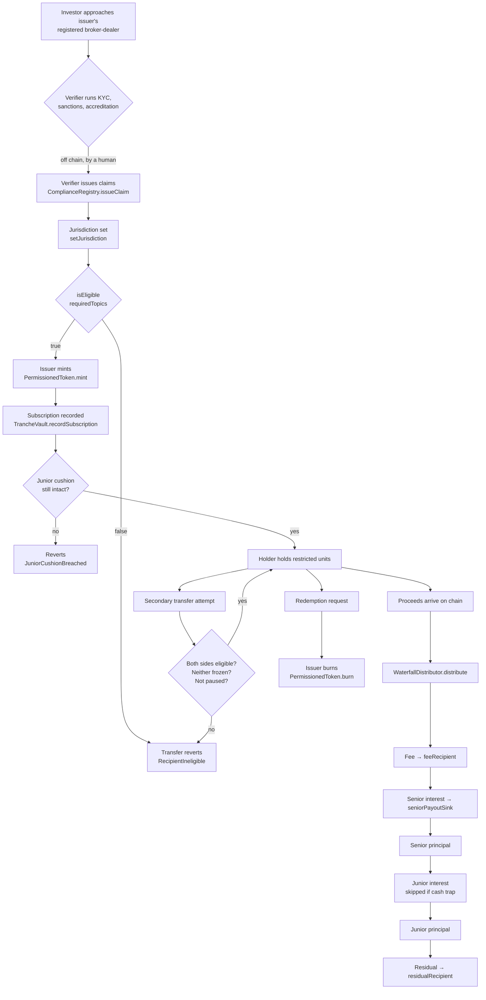

# Token flow — subscription to redemption

Every hop below names the contract that enforces it. Where a step is a human
decision or an off-chain fact, it says so. Nothing here is enforced by wishing.

There are **two contract families** in this repo and they do different jobs:

| Family | Path | Job | Tests |
|---|---|---|---|
| **Capital markets** | `contracts-capital-markets/` | Who may hold, tranching, waterfall, document anchoring | **78 passing** |
| **DGX native** | `contracts/` | Bullion passporting, concession streaming, DvP, reserves oracle | **2 passing** |

Read that tests column before you plan a deployment. The capital-markets suite
is exercised hard, including fuzz runs. The DGX native suite compiles clean and
has two happy-path tests. That is a real difference in maturity, not a
formatting quirk.

---

## The flow

---

## Hop by hop

### 1. Eligibility is established off chain, recorded on chain

`ComplianceRegistry` does **not** verify anyone. It records that a designated
verifier asserted a claim, and when that assertion lapses.

Six claim topics ship as constants:

| Topic | Constant | Means |
|---|---|---|
| 1 | `TOPIC_KYC` | Identity verified |
| 2 | `TOPIC_SANCTIONS_CLEARED` | Screened against sanctions lists |
| 3 | `TOPIC_ACCREDITED_506C` | US Reg D 506(c) accredited |
| 4 | `TOPIC_QUALIFIED_PURCHASER` | US 3(c)(7) qualified purchaser |
| 5 | `TOPIC_SOPHISTICATED_S708` | AU Corporations Act 2001 s708 |
| 6 | `TOPIC_REG_S_NON_US` | Reg S offshore |

`isBaselineEligible` requires KYC **and** sanctions clearance, an unblocked
jurisdiction, and not frozen. `isEligible(subject, requiredTopics)` adds
whatever the instrument demands on top — so a 506(c) offering and a Reg S
tranche can run off one registry with different topic sets.

Four design decisions worth knowing before you integrate:

- **Claims must expire.** `issueClaim` reverts on any `expiresAt` in the past
  and there is no never-expires option. A permanent accreditation flag is the
  exact pattern that fails 506(c).
- **Unknown jurisdiction fails closed.** `bytes2(0)` is not a pass.
- **Freeze overrides live claims.** `setFrozen` flips the gate without touching
  the claim, so the record of what was verified survives a court order or an
  OFAC hit.
- **Revocation never deletes.** That a claim once existed is the audit trail.

### 2. Minting is gated, and so is every transfer after it

`PermissionedToken` checks the registry on `mint`, `transfer` and
`transferFrom`. An ineligible recipient does not receive units and get unwound
later — the call reverts with `RecipientIneligible`.

`forceTransfer` exists for court orders and lost keys. It still requires the
**recipient** to be eligible, and it emits a `reason` string. An issuer cannot
quietly move units to a wallet that could not have received them normally.

Issuer handoff is two-step — `initiateIssuerTransfer` then
`acceptIssuerTransfer` — so a fat-fingered address cannot orphan the issuer
role.

### 3. Tranching enforces the cushion

`TrancheVault` holds a senior and a junior tranche, each with a target size and
a coupon in basis points. `recordSubscription` reverts with
`JuniorCushionBreached` if taking the subscription would push the junior ratio
below the configured minimum. The cushion is a rule, not a policy someone
remembers to check at quarter end.

### 4. The waterfall conserves, and the contract proves it

`distribute(payer, gross)` pays strictly in order: fee, senior interest, senior
principal, junior interest, junior principal, residual. Two behaviours matter:

- **Cash trap mode skips junior interest** and pushes everything at senior
  principal. That is the covenant working.
- **Conservation is asserted, not assumed.** If the parts do not sum to gross,
  the call reverts with `ConservationBroken`. There is a fuzz test —
  `testFuzz_conservationAlwaysHolds` — that hammers this across 512 runs.

The fee has a hard cap in basis points; `setFeeBps` reverts above it.

### 5. Documents are anchored, not proven

`ReserveProofAnchor` stores a SHA-256 digest with an attestor, timestamp,
expiry and revocation state. Status is an enum — `Unknown | Active | Expired |
Revoked` — deliberately not a boolean, because an expired instrument and a
never-anchored one are not the same fact and an integrator branching on "does
this hash exist" would treat them identically.

Prefer `verifyDocument(bytes)` over `statusOf(bytes32)`. It re-hashes the
caller's bytes, so the caller has to hold the actual document rather than a
digest somebody handed them. The `uri` field is explicitly untrusted — nothing
on chain can check that the file at a URL still matches.

### 6. Redemption

`burn` is issuer-only. On the DGX native side, `DGXBullionToken.redeemPhysical`
emits a delivery request against a bar passport — the metal still moves because
a vault operator moves it.

---

## Where the DGX native contracts sit

`DGXBullionToken` carries an `LbmaBarPassport` per bar hash — serial number,
vault enclave, fine grams — and mints against an enrolled bar.
`ProofOfReservesOracle` records total vaulted grams plus an IPFS hash of an
audit report, signed by a primary auditor. `MiningStreamingForge` enrolls a
concession with proven and committed ounces and logs refinery deliveries.
`AtomicSettlementDvP` swaps payment against asset in one transaction or neither
leg moves.

These are the *gold-specific* layer. The capital-markets suite is the
*instrument* layer. A live deployment uses both: bar passports and reserve
attestations feed the anchor and the oracle; eligibility, tranching and the
waterfall govern who may hold the resulting claim and in what order they get
paid.
